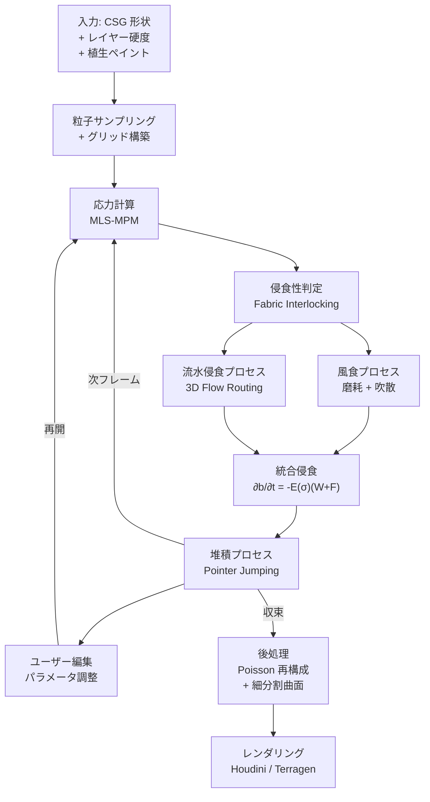
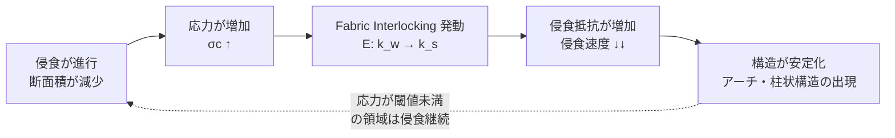
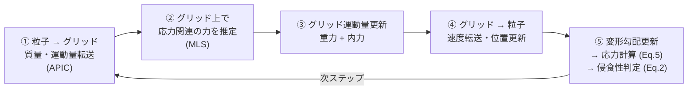
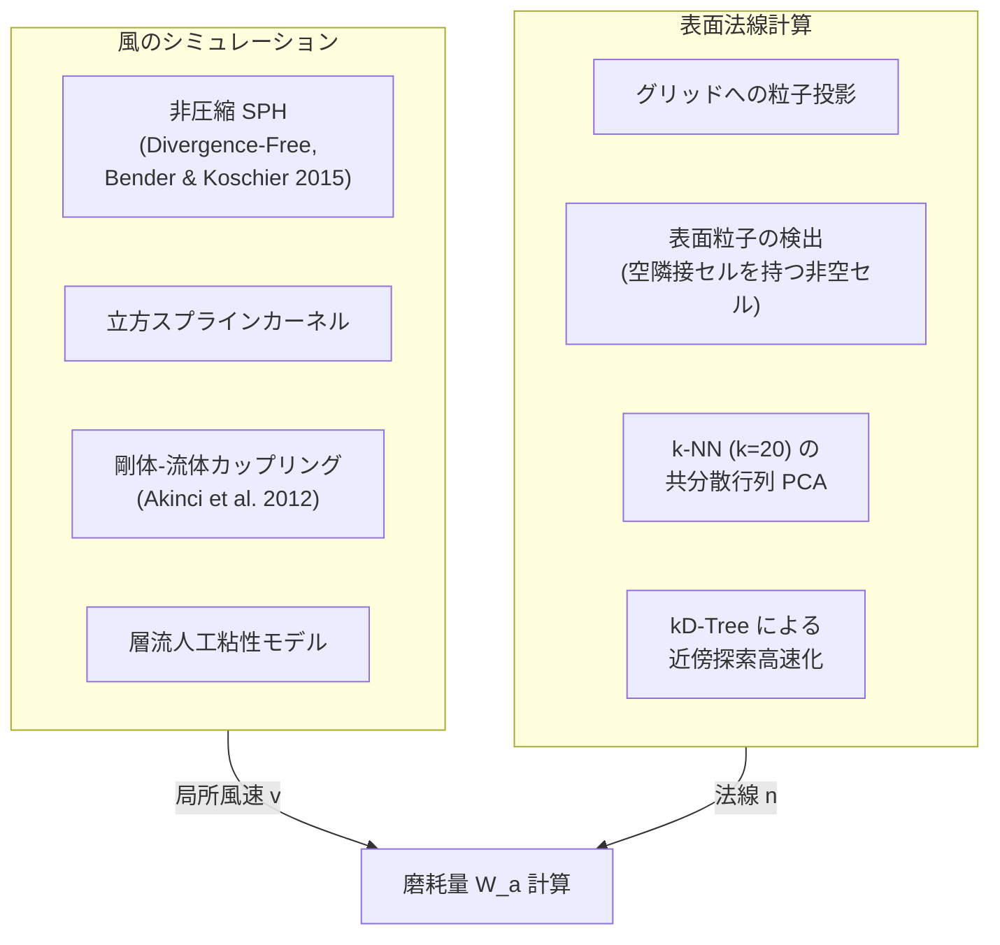
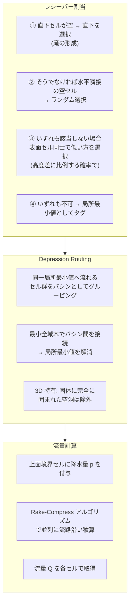
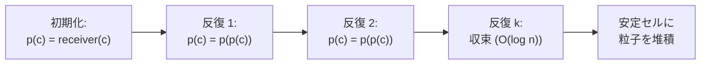

# Arenite: 砂岩シミュレーション技術の網羅的分析レポート

> **論文**: "Arenite: A Physics-based Sandstone Simulator"
> **著者**: Zhanyu Yang, Aryamaan Jain, Guillaume Cordonnier, Marie-Paule Cani, Zhaopeng Wang, Bedrich Benes
> **所属**: Purdue University / Inria, Université Côte d'Azur / École Polytechnique, CNRS (LIX), IP Paris
> **発表**: ACM Transactions on Graphics, Vol. 44, No. 4 (SIGGRAPH 2025)
> **DOI**: https://doi.org/10.1145/3731201

---

## 1. エグゼクティブサマリー

Arenite は、砂岩地形の形成過程を物理ベースでシミュレーションする初のシステムである。その核心的な知見は、**内部応力と侵食の負のフィードバック**（fabric interlocking）を再現することで、アーチ・フードゥー・ビュート・アルコーブ・洞窟ネットワークなど、自然界で観察される多様な砂岩構造が単純な初期条件から自発的に出現するという点にある。ハイブリッド粒子-グリッドデータ構造上で MLS-MPM による応力計算、SPH ベースの風食、3D 流水侵食、粒子堆積を統合し、GPU 実装により最も複雑な事例でもデスクトップ PC 上で 5 分未満で完了する。

---

## 2. アーキテクチャ概要

### 2.1 シミュレーションパイプライン

### 2.2 核心フィードバックループ

この負のフィードバックが、従来の侵食シミュレーションでは再現できなかった砂岩特有の構造（アーチ、ピラー、アーケード等）を自発的に生成する鍵である。

---

## 3. コアインサイト: 応力-侵食の負のフィードバック

### 3.1 地形学的背景

砂岩は砂粒（石英・長石）がセメント質（シリカ等）で固結した堆積岩である。Bruthans et al. (2014) が発見した重要な現象として、**fabric interlocking** がある。これは高い荷重下で砂粒の化学的溶解・再沈殿が促進され、空隙率が低下し粒子接触面積が増大することで、侵食耐性が劇的に向上するメカニズムである。

### 3.2 数学的モデル

岩石表面の微小体積の **viability**（生存可能性） `b` は以下で時間発展する:

$$\frac{\partial b}{\partial t} = -\mathcal{E}(\sigma_c)(W + F)$$

- `W`: 風食による局所侵食量
- `F`: 流水侵食による局所侵食量
- `E(σ_c)`: Cauchy 応力テンソル `σ_c` に依存する侵食性関数

**侵食性の二状態スイッチ**:

$$\mathcal{E}(\sigma_c) = \begin{cases} k_s & \text{if } \mathrm{trace}(\sigma_c) > I \\ k_w & \text{otherwise} \end{cases}$$

| パラメータ | 意味 | 典型値 |
|---|---|---|
| `k_w` | 弱い岩石の侵食性（未インターロック） | 1×10⁻⁴ year⁻¹ |
| `k_s` | 強い岩石の侵食性（インターロック後） | 1×10⁻⁶ year⁻¹ |
| `I` | Fabric interlocking 閾値 | 1.0 - 6.0 MPa |

`k_w ≫ k_s` であるため、応力が閾値を超えた領域では侵食速度が約 100 倍低下する。この非線形スイッチが、柱・アーチ・ピラーの自発的出現を可能にする。

### 3.3 従来手法との差異

| 手法 | 応力考慮 | 結果 |
|---|---|---|
| Jones et al. (2010) 曲率ベース侵食 | なし | 均一な丸み、アーチ不可 |
| 一般的 hydraulic erosion | なし | 2.5D 地形のみ |
| **Arenite** | **Fabric interlocking** | **アーチ・アーケード等が自発出現** |

---

## 4. ハイブリッドデータ構造（粒子-グリッド）

### 4.1 設計思想

Arenite は流体シミュレーションの MPM と同様の粒子-グリッドハイブリッド構造を採用するが、その目的が根本的に異なる。

| 要素 | 流体 MPM | Arenite MPM |
|---|---|---|
| 粒子の役割 | 動的運動の追跡 | **風化状態の追跡** |
| 移動 | 物理的な流れ | 侵食による除去・堆積による追加 |
| グリッドの役割 | 力の計算 | 応力分布の計算 |
| トポロジー変化 | 不要 | **低コストで許容** |

### 4.2 粒子が保持する情報

| フィールド | 記号 | 説明 |
|---|---|---|
| 質量 | `m_p` | 粒子の質量 |
| 位置 | `x_p` | 3D 空間座標 |
| 速度 | `v_p` | MPM 計算用 |
| 変形勾配 | `F_p` | 応力計算のためのテンソル |
| Viability | `b` | 侵食の進行度（1.0 → 0.0 で除去） |
| 侵食性パラメータ | `k_w, k_s` | 堆積層ごとに異なる |

### 4.3 グリッド

- 正規 3D グリッド（典型的に 128³）
- MPM における応力計算の効率的な離散化基盤
- 流水侵食の flow routing にも再利用

---

## 5. 応力計算: MLS-MPM

### 5.1 力学モデル

砂岩は**硬い弾性体**としてモデル化される。質量保存とモメンタム保存:

$$\frac{D\rho}{Dt} + \rho \nabla \cdot \mathbf{v} = 0$$

$$\rho \frac{D\mathbf{v}}{Dt} = \nabla \cdot \boldsymbol{\sigma} + \rho \mathbf{g}$$

構成則には **corotated モデル**（Stomakhin et al. 2012）を使用:

$$\boldsymbol{\sigma} = \frac{1}{J}\left[2\mu(\mathbf{F} - \mathbf{R}) + \lambda(J-1)J\mathbf{F}^{-\top}\right]\mathbf{F}^\top$$

| パラメータ | 意味 | 値 |
|---|---|---|
| `μ` | Lamé パラメータ | 15 GPa |
| `λ` | せん断弾性率 | 12 GPa |
| `F` | 変形勾配テンソル | `F = RS`（極分解） |
| `J` | `det(F)` | 体積変化率 |

### 5.2 MLS-MPM 離散化

Moving Least Squares Material Point Method（Hu et al. 2018）を使用。各タイムステップ:

**APIC**（Affine Particle-in-Cell, Jiang et al. 2015）転送スキームにより、粒子-グリッド間の運動量保存を高精度に保つ。二次重み関数 `w_ip` を採用し、性能とのバランスを確保。

### 5.3 動的崩壊への対応

MPM の動的性質により、過度に侵食された岩塊が応力限界を超えた場合の**ブロック落下**も自然にシミュレーションされる（Fig. 3）。これは静的な侵食シミュレータでは不可能な挙動である。

---

## 6. 風食プロセス

風食は乾燥した砂岩環境において極めて重要な形成要因であり、Arenite は2つの異なるメカニズムを分離してモデル化する。

$$W = W_a + W_d$$

### 6.1 風磨耗（Abrasion）: `W_a`

風で運ばれた砂粒が岩石表面に衝突して砂岩粒子を削り取る現象。

$$W_a = k_a \|\mathbf{v}\|(-\mathbf{n} \cdot \mathbf{v})_+$$

- `k_a`: 磨耗パラメータ（飛散粒子の質量・径に依存）
- `v`: 局所風速
- `n`: 岩石表面の法線
- `()+`: 正値クランプ

**実装の工夫**:
- 風粒子の解像度は砂岩粒子の約 **1/10** に粗く設定（風速場はそこまで高解像度が不要なため）
- 砂岩粒子は風の SPH シミュレーションに対して**静的障害物**として扱われる
- 風ドメインは砂岩グリッドの 2 倍サイズで定義

### 6.2 風吹散（Deflation）: `W_d`

風が長期間にわたって岩石表面から微粒子を直接剥離する現象。磨耗が嵐時の局所的・方向性のある作用であるのに対し、吹散は長期平均的でより均一な作用。

**Mohr-Coulomb 乾燥摩擦則**による剥離条件:

$$F_n^c = \mu_c + \mu_f \cdot \mathrm{tr}(\boldsymbol{\sigma})$$

| パラメータ | 意味 | 値 |
|---|---|---|
| `μ_c` | 内部凝集係数 | 1 MPa |
| `μ_f` | 乾燥摩擦係数 | 0.75 |
| `σ` | Cauchy 応力（Sect.4 より） | — |

法線方向ドラグ力の確率分布に **Rayleigh 分布**を仮定し、長時間平均を解析的に積分:

$$W_d = k_d \exp\left(-\frac{(\mu_c + \mu_f \cdot \mathrm{tr}(\boldsymbol{\sigma}))^2}{2\alpha^2}\right)$$

- `k_d`: 吹散係数
- `α`: 風の強さのスケーリング係数

**注目すべき点**: 応力 `σ` が吹散にも影響する。高応力領域（interlocking 状態）では `tr(σ)` が大きくなり、指数関数内の分子が増大するため `W_d` が急速に減少する。これは fabric interlocking が風吹散に対しても抵抗力を発揮することを意味する。

### 6.3 アブレーション分析まとめ

| 磨耗のみ | 吹散のみ | 両方 |
|---|---|---|
| 方向性のある非均一な侵食 | 対称的な穴の形成 | 非対称で自然な構造 |
| アーチ形成不可 | アーチは形成されるが均一 | 風向きに応じた多様な形状 |

---

## 7. 流水侵食（3D）

乾燥した砂岩環境でも、エピソディックな暴風雨による水流が侵食の重要な要因となる。

### 7.1 せん断応力侵食則

Howard (1994) のモデルに基づく:

$$F = k_t (k_f \cdot Q^{0.6} \cdot S^{0.7} - \tau_c)_+$$

| 記号 | 意味 | 備考 |
|---|---|---|
| `Q` | 流量（discharge） | 上流の降水量の累積 |
| `S` | 勾配 | 法線 `n` から導出 |
| `τ_c` | 臨界せん断応力 | 低流量での侵食を抑制 |
| `k_t` | 流水侵食係数 | — |
| `k_f` | 流量-応力変換係数 | 8×10⁻⁵ Pa·m⁻³·s⁻¹ |

`τ_c` は Stream Power Law にはない項であり、小スケール地形の現実的な侵食パターンの鍵となる。

### 7.2 3D Flow Routing

既存の Flow Routing アルゴリズムは 2.5D 高度場に限定されていた。Arenite は Fastflow（Jain et al. 2024b）を **3D に拡張**した。

**勾配 `S` の計算**: 表面法線 `n` から導出:

$$S = \sqrt{n_x^2 + n_y^2} / |n_z|$$

### 7.3 生成される構造

| 構造 | 主要侵食因子 | メカニズム |
|---|---|---|
| キャニオン | 流水（高流量） | 高い discharge が深い切り込みを形成 |
| 洞窟ネットワーク | 流水（地下水路） | 地下の水路に沿った内部侵食 |
| ビュート | 流水 + 風食 | 上面からの流水で柱状に分離、風で形状を整える |
| ガリー | 流水（低〜中流量） | 臨界せん断応力が樹状パターンを制御 |

---

## 8. 堆積モデル

侵食で剥離した粒子は重力によって安定位置に堆積する。

### 8.1 アルゴリズム

1. **安定セルの定義**: 表面粒子の平均勾配が安息角（talus slope）未満のセル
2. **Deposition Pointer**: 各表面セル `c` に対し、最も近い下方の安定セルを指すポインタ `p(c)` を設定
3. **Parallel Pointer Jumping**: `p(c) = p(p(c))` を最大 `log(n)` 回反復（`n` = 表面セル数）

### 8.2 アーティファクト防止

- **ランダムグリッドオフセット**: 各堆積ステップでグリッドをランダムにずらし、粒子が同一セルに集中する階段状アーティファクトを防止
- **堆積粒子の viability**: 堆積物はセメント質を欠くため、元の砂岩より低い viability（例: 0.01〜0.2）が設定される。これにより堆積物はさらなる侵食を受けやすく、自己遮蔽効果の制御が可能

---

## 9. ユーザーインタラクションとオーサリング

### 9.1 入力の定義

| 要素 | 方法 | 説明 |
|---|---|---|
| 初期形状 | CSG ツリー | 立方体・球の union/intersection |
| 堆積層 | 高度値スタック | 各層に `(k_w, k_s)` を指定 |
| 侵食性 | ブラシペイント | 特定粒子に直接値を設定 |
| 植生 | ブラシペイント | 侵食の遮蔽効果を付与 |
| ノイズ摂動 | Perlin noise | 侵食性パラメータに自然な揺らぎを追加 |

### 9.2 インタラクティブワークフロー

1. 粗い初期形状を配置（1 分未満）
2. シミュレーション実行
3. **途中で停止し**、風向き・風速をリアルタイム調整可能
4. 現在の状態をベースにブラシで追加編集
5. 新しい形状（シリンダー等）を追加して再シミュレーション
6. 収束まで反復

### 9.3 植生の効果

植生は侵食性を調整し遮蔽効果を発揮する。堆積エリアの麓に新たな植物が生育し、侵食パターンに影響を与えるフィードバックも考慮されている。

---

## 10. GPU 実装とパフォーマンス

### 10.1 技術スタック

| レイヤー | 技術 |
|---|---|
| 言語 | Python |
| テンソル演算 | PyTorch |
| 並列カーネル | Taichi (Hu et al. 2019) |
| 低レベル最適化 | Custom CUDA kernels |

### 10.2 フレームあたりの計算コスト内訳

| コンポーネント | 所要時間 | 割合 |
|---|---|---|
| MLS-MPM（応力計算） | ~20 ms | 10% |
| 風食（SPH + 吹散） | ~5 ms | 2.5% |
| 3D Flow Routing（流水侵食 + 堆積） | ~180 ms | 87.5% |
| **合計** | **~200 ms** | **100%** |

Flow routing が支配的であり、これは Fastflow の 3D 拡張に伴う計算量増大を反映している。

### 10.3 スケーラビリティ

| グリッド解像度 | 粒子数 | GPU メモリ | フレーム時間 |
|---|---|---|---|
| 128³ | 1M | ~5 GB | ~5 sec |
| 192³ | 4M | ~10 GB | ~10 sec |
| 256³ | 9M | ~18 GB | ~20 sec |
| 320³ | 18M | ~30 GB | ~35 sec |
| 384³ | 30M | ~45 GB | ~50 sec |

### 10.4 最終シミュレーション時間

インタラクティブ設定（1-3M 粒子、128³ グリッド）で最も複雑な例でも **5 分未満**で完了。高解像度（9M-27M 粒子）ではより長くなるが、ディテール（層状構造の突起、表面の不規則性）が大幅に向上。

### 10.5 ハードウェア

- CPU: Intel Xeon Gold 2.10 GHz
- RAM: 128 GB
- GPU: NVIDIA RTX A6000 (48 GB VRAM)

---

## 11. 後処理とレンダリング

### 11.1 メッシュ再構成

粒子群からレンダリング可能なメッシュへの変換:

1. **Screened Poisson Surface Reconstruction**（Kazhdan & Hoppe 2013）: 法線付き点群から滑らかな表面メッシュを再構成
2. **Least Squares Subdivision Surfaces**（Boyé et al. 2010）: メッシュの品質向上

### 11.2 テクスチャリングとレンダリング

| 要素 | 技術 |
|---|---|
| テクスチャマッピング | Tri-planar mapping |
| 植生 | プロシージャル生成 |
| レンダラー | Houdini（主要）/ Terragen（一部） |

Tri-planar mapping は UV 展開が不要で、複雑な侵食表面にも均一にテクスチャを適用できるため、動的に形状が変化するシミュレーション結果に適している。

---

## 12. 検証とアブレーション

### 12.1 実験との比較

| 比較対象 | 方法 | 結果 |
|---|---|---|
| Bruthans et al. (2014) 実験室実験 | 弱いセメント凝集体を水で数ヶ月侵食しアーチを形成 | Arenite は同条件下で類似のアーチ輪郭を再現 |
| Jones et al. (2010) 曲率ベース侵食 | 表面曲率に基づく体積侵食 | 応力を考慮しないためアーチ・アーケード形成不可 |

### 12.2 アブレーション結果

#### 侵食メカニズムの組み合わせ

| 風食のみ | 流水侵食のみ | 両方 |
|---|---|---|
| 柱の分離不可 | 層状構造の特徴なし | フードゥーが正しく形成 |

#### 風磨耗 vs 風吹散

| 磨耗のみ | 吹散のみ | 両方 |
|---|---|---|
| アーチ構造不可 | 対称的な穴 | 非対称で自然なアーチ |
| 方向性のある非均一侵食 | 均一な侵食 | 方向性 + 全体的な後退 |

#### Fabric Interlocking 閾値 `I` の感度

| I = 0.25 MPa | I = 1.0 MPa | I = 4.0 MPa | I = +∞ |
|---|---|---|---|
| 極めて早期に侵食停止 | 適度なアーチ形成 | 薄い底部を持つアーチ | 均一侵食、不自然な形状 |

閾値が低すぎると小さな応力で即座にインターロックが発動し侵食が停止。高すぎるとインターロックが効かず全体が均一に侵食される。

#### 流水臨界せん断応力 `τ_c` の感度

| τ_c = 0.0 | τ_c = 1.5 |
|---|---|
| 稜線と鞍部が結合 | 侵食パターンが分離・明確化 |

#### 堆積物 viability の感度

| b = 1.0（高い） | b = 0.01（低い） |
|---|---|
| 堆積斜面の安定性が高い | 堆積物が広がり斜面角が緩い |
| 自己遮蔽効果が大きい | 構造の自己保護が弱い |

---

## 13. 制限事項と将来の方向性

### 13.1 現在の制限

| 制限 | 理由 |
|---|---|
| **亀裂伝播の欠如** | 砂岩の異方性・不均一性により、微小亀裂からの伝播モデルには過去の地殻変動の完全なモデル化が必要 |
| **水分浸透の未モデル化** | セメント材の種類や既存欠陥に依存し、正確な表現が困難 |
| **植生の単純化** | 均一レイヤーとして扱い、根系による生物的侵食は未考慮 |
| **大規模シーンのスケーラビリティ** | GPU メモリと計算時間による制約（384³ / 30M 粒子が現実的な上限） |
| **風のシミュレーション精度** | 単純な SPH ベースで、乱流モデルやより精密な空気力学は未導入 |

### 13.2 将来の展望

- 亀裂伝播モデルの統合（異なる岩種への一般化）
- マルチスケール・分散アルゴリズムによる大規模シーン対応
- 大規模地形生成手法との結合
- より高精度な風シミュレーションの影響評価
- 植生のマルチスケール相互作用

---

## 14. oRoNOiDE エンジンへの関連性

### 14.1 技術的な接点

| Arenite の技術 | oRoNOiDE での対応可能性 |
|---|---|
| 粒子-グリッドハイブリッド構造 | sparse voxel + 粒子の二重表現と類似構造 |
| 応力-侵食負フィードバック | **破壊システムへの直接的な応用**: 荷重を受ける構造の選択的崩壊 |
| MLS-MPM による応力計算 | 物理ベース破壊の事前応力解析に利用可能 |
| Fabric interlocking 概念 | 材料の内部状態（密度・空隙率・鉱物組成）が侵食耐性に影響するモデルは、エンジンの material field 設計方針と合致 |
| 3D Flow Routing | ボクセル世界上の水流シミュレーション（環境効果） |
| Viability フィールド | voxel leaf の構造健全性フィールドとして実装可能 |

### 14.2 設計上の示唆

- **「内部構造が外見を決定する」** という Arenite の思想は、oRoNOiDE の「物理的に意味のある内部フィールドを保持し、そこから表面のレンダリングと破壊挙動を導出する」というアーキテクチャ方針と深く共鳴する
- Arenite の二状態侵食性スイッチは、応力テンソルの trace という単一スカラーで切り替わる点で計算コストが低く、リアルタイムゲームエンジンでの近似モデルとして有望
- 堆積の parallel pointer jumping は、破壊後の瓦礫配置にも応用できる可能性がある

---

## 付録: 主要パラメータ一覧

### 構造ごとのシミュレーションパラメータ

| 構造 | 粒子数 | I (MPa) | k_a (m⁻²s⁻²) | k_d (m⁻²s⁻²) | τ_c (Pa) | k_t (Pa⁻¹) |
|---|---|---|---|---|---|---|
| アーチ | 1M | 1.5 - 3 | 2.5e-6 ~ 2.5e-5 | 5e-8 ~ 5e-7 | 5 | — |
| マッシュルーム | 1M | 3 - 6 | 2e-6 ~ 2e-5 | 1e-8 ~ 1e-7 | 5 | — |
| アーケード | 2.5M | 1 - 6 | — | 2e-7 ~ 8e-7 | 5 | — |
| アルコーブ | 1.5M | 1.5 - 3 | 2e-6 ~ 4e-5 | 2e-8 ~ 4e-7 | 5 | 1e2 |
| ビュート | 1.5M | 6 | 1e-6 | 1e-8 | 1 | 4e2 ~ 8e2 |

### 共通パラメータ

| パラメータ | 値 | 単位 |
|---|---|---|
| 弱い岩石侵食性 k_w | 1×10⁻⁴ | year⁻¹ |
| 強い岩石侵食性 k_s | 1×10⁻⁶ | year⁻¹ |
| Lamé パラメータ μ | 15 | GPa |
| せん断弾性率 λ | 12 | GPa |
| 内部凝集 μ_c | 1 | MPa |
| 乾燥摩擦 μ_f | 0.75 | — |
| 流量係数 k_f | 8×10⁻⁵ | Pa·m⁻³·s⁻¹ |
| タイムステップ Δt | 1000 | year |
