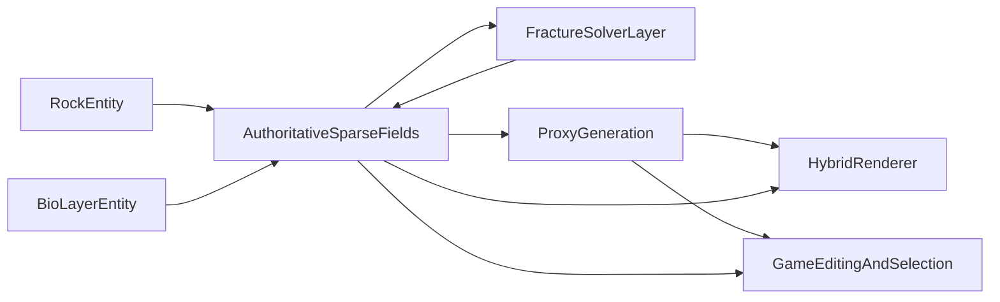

# Stone Structural Realism Report

## 0. Executive Decision

要件（超高解像度の外観、構造的一貫性、破壊・内部表現、ゲーム内オブジェクト性、石+植物識別）を同時に満たす最有力構成は、次の三本柱である。

1. **権威状態は sparse volumetric fields（SDF/voxel + material/mechanics fields）**
2. **表示は hybrid renderer（raster 主体 + path transport 補完）**
3. **破壊は連続体ベース solver を役割分担（phase-field / peridynamics / MPM 系）**

この構成では、メッシュは常に派生プロキシであり、真実は体積構造側にある。  
そのため「見た目は綺麗だが割ると破綻する」を避けられ、内部露出、硬さ、割れ方、選択ハイライト、再配置、石+植物識別を一つの整合した設計で扱える。

---

## 1. 要件分解（MECE）

### 1.1 外観（Visual Fidelity）
- 写真級のマクロ形状、メソスケール粗さ、ミクロ法線、鉱物由来の色・反射差
- 風化・摩耗・濡れ・汚れ・付着物（苔、薄い土膜）の時変変化

### 1.2 構造（Structural Correctness）
- 内部まで連続した材質・物性場
- 断面露出時に内部の鉱物分布と見た目が矛盾しない

### 1.3 力学（Mechanics）
- 弾性・破断・欠け・粉砕のモード差
- 入力条件（衝撃方向、速度、拘束）に依存した破壊分岐

### 1.4 オブジェクト性（Game Objectness）
- 単一オブジェクトとして pick/select/transform/instance が可能
- 破壊後に fragment 群へ lineage 付き分割可能

### 1.5 生態被覆（Bio Integration）
- 石と植物（苔・小植物）を識別可能
- 付着・剥離・根の侵入による局所物性変化を表現可能

---

## 2. 基盤データ構造と「主体」

## 2.1 主体は何か

主体は **`RockEntity`（岩体）** と **`BioLayerEntity`（生体被覆）** の 2 系統を持つ。

- `RockEntity`: 幾何・材質・物性・破壊の権威データを保有
- `BioLayerEntity`: 石表面/浅層に付着する別主体。成長・湿潤応答・剥離規則を持つ
- 両者は「接触面積」「付着強度」「水分輸送」などの coupling field で接続

この分離により、ゲーム上は「石だけ選択」「苔だけ選択」「両方選択」を運用できる。

## 2.2 権威データ（Authoritative Fields）

`RockEntity` の中核は sparse volume（hashed voxel blocks / sparse brick pool / VDB 系）に保持する以下の field 群。

- **Geometry fields**
  - `phi_sdf`: signed distance
  - `grad_phi`: 法線計算用補助（必要ならオンデマンド）
- **Material fields**
  - `mineral_id`（quartz, feldspar, mica, basaltic glass など）
  - `volume_fraction[mineral]`
  - `grain_size`, `porosity`, `layering_orientation`
- **Mechanical fields**
  - `E`（Young's modulus）, `nu`（Poisson ratio）, `rho`（density）
  - `Gc`（fracture toughness）, `sigma_t`（tensile strength）
  - `anisotropy_tensor`（割れやすい方向）
- **State fields**
  - `damage_d`（phase-field 的損傷）
  - `moisture`, `temperature`（必要に応じた劣化連成）
  - `topology_version`

## 2.3 ID と識別体系

- `instance_id`: ゲーム編集用の個体 ID（選択、ハイライト、再配置）
- `submaterial_id`: 岩体内サブ領域識別（鉱物塊・脈）
- `fragment_id` + `parent_fragment_id`: 破壊後 lineage
- `bio_patch_id`: 苔/植物パッチ単位識別

これにより、外観だけでなく「何が何者か」を常時追跡できる。

---

## 3. 外観表現の技術マップ（MECE）

## 3.1 スケール分解で扱う

### A. マクロ形状（cm〜m）
- 主表現: `phi_sdf` からの dual contouring / adaptive meshing
- 補助: 風化・欠けを生成する procedural geology operators

### B. メソ粗さ（mm〜cm）
- 主表現: displacement/micro-geometry tiles（岩種条件付き）
- 補助: directional erosion operators（水流方向、重力方向）

### C. ミクロ表面（um〜mm）
- 主表現: SVBRDF/BTF クラスの測定・推定モデル
- 補助: mineral-aware normal/roughness synthesis

### D. 鉱物分布・層理
- 主表現: volumetric mineral field 由来の投影（表面だけに貼らない）
- 補助: vein generation（石英脈）と metamorphic banding

### E. 風化・汚れ・濡れ
- 主表現: time-evolving weathering layer（反応拡散 + 侵食ルール）
- 補助: moisture-dependent BRDF parameter shift

### F. 苔・植物被覆
- 主表現: `BioLayerEntity`（薄膜 + 小インスタンス群）
- 補助: 反応拡散/資源場ベース成長（光・湿度・粗さ依存）

## 3.2 代表技術の使い分け

- **SVBRDF**: 多くの岩種に対し現実的なトレードオフ。標準 PBR パイプへ接続しやすい
- **BTF**: 視線・入射依存が強い複雑表面に有効（高コストだが高忠実度）
- **Spectral/polarization rendering（限定適用）**: 石英系の強い光学特性を検証・高忠実度モードで再現
- **Procedural geology synthesis**: 無限バリエーションと内部整合性確保に必須

---

## 4. 弾性・割れ方・内部表現の技術マップ

## 4.1 破壊 solver の役割分担

### Phase-field fracture
- 強み: 分岐・合体を含む亀裂進展の位相管理が安定
- 用途: 準静的〜中速の brittle crack propagation

### Peridynamics
- 強み: 非局所相互作用で crack initiation が自然
- 用途: 異方性岩石や複雑欠陥を含むケース

### CD-MPM / MLS-MPM 系
- 強み: 大変形・分離・接触処理に強い
- 用途: 砕片化や高エネルギー衝突、インタラクティブ破断

### XFEM + CZM
- 強み: 連続体精度と crack-front 記述のバランス
- 用途: 高忠実度オフライン参照、校正用

## 4.2 ランタイム戦略（2030+前提）

- 通常時: 軽量接触（broad phase + proxy narrow phase）
- 破壊イベント時: 局所領域のみ高コスト solver を起動
- 結果反映: `damage_d` と material field を更新し `topology_version` を進める

## 4.3 内部露出の一貫性

破断面は「新規 UV を貼る」のではなく、体積 field の断面として生成する。

- 断面色: `mineral_id` と `volume_fraction` から再評価
- 断面粗さ: 破断エネルギーと粒径から決定
- 断面脆性粉: 砕片生成規則により別インスタンス化

これで外側と内側の見た目・物性矛盾を最小化できる。

---

## 5. レンダリング方式の選定（Raster / PT / Hybrid）

## 5.1 結論

最有力は **Hybrid**。  
`raster` を一次可視・GBuffer・編集操作の低遅延に使い、`path tracing` を光輸送が効く要素へ重点投入する。

## 5.2 使い分け

- **Raster 側**
  - 一次可視、深度、ID バッファ（pick/highlight）
  - 速度優先のシャドウ・可視性前処理
- **Path 側**
  - GI、接触陰影、反射、半透明鉱物の透過寄与
  - 破断面・濡れ面など高周波ハイライト領域
- **時空間再利用**
  - ReSTIR 系サンプリング再利用 + denoise（品質保持加速）

## 5.3 高忠実度モード

GPU 余力がある場合に以下を段階開放する。

1. バウンス数増加
2. スペクトル次元の精密化
3. レイ予算増
4. denoise 依存の逓減

同一データ構造のまま品質を上げられる点が重要。

---

## 6. オブジェクト認識・選択・編集

## 6.1 必須機構

- `instance_id` バッファで pick
- 選択時アウトライン/ハイライト（ID ベース）
- gizmo transform（移動/回転/スケール）
- 破壊後は fragment 単位で再選択可能

## 6.2 石と植物の識別

- `RockEntity` と `BioLayerEntity` を別 ID 空間化
- 同じ画素上でも layered picking（前面優先/フィルタ選択）を提供
- ゲーム制作側で「石だけ移動」「植物だけ差し替え」を可能化

---

## 7. 統合アーキテクチャ

## 7.1 データフロー原則

1. 編集/衝突入力は常に `authFields` を更新
2. `topology_version` 変更時のみ proxy を再構築
3. render/physics は同一 version を参照（parity 保証）

## 7.2 構造不変条件（運用）

- parent/child linkage の妥当性
- occupancy mask と実割当の一致
- chunk seam coherence
- render/physics の version parity

---

## 8. 要件→技術 対応表

| 要件 | 推奨技術 | 主理由 |
|---|---|---|
| 石の超高解像度外観 | SDF主体形状 + SVBRDF/BTF + procedural geology | 高周波を持ちつつ編集可能 |
| 構造的一貫性 | Authoritative volumetric material/mechanics fields | 内部露出と物性を同一ソース化 |
| リアルな割れ方 | Phase-field / peridynamics / MPM 役割分担 | 破壊モードを物理原理で表現 |
| 弾性と衝突 | 物性場駆動の event-based simulation | 常時軽量・イベント時高精度 |
| オブジェクト認識/選択 | instance_id + lineage + layered picking | 制作運用とインタラクション成立 |
| 石+植物バリエーション | Rock/Bio 二主体 + coupling fields | 識別と相互作用を両立 |
| 2030+リアルタイム品質 | Hybrid renderer + ReSTIR系再利用 | 高品質輸送を実時間へ寄せる |

---

## 9. なぜこの構成が最も現実的か（Rationale）

1. **単一権威状態**  
   形状・材質・物性・破壊履歴が一つの場に集約されるため、断面・破壊片・衝突応答が分離実装にならない。

2. **レンダリングとシミュレーションの責務分離**  
   「何が存在するか」は volume が決め、「どう見せるか」は hybrid renderer が担う。設計の破綻点が減る。

3. **ゲーム制作ワークフローと両立**  
   ID ベースの pick/select/transform を最初から組み込むため、研究的手法でも実制作に接続できる。

4. **将来 GPU スケールに自然対応**  
   品質向上は主にサンプル予算・輸送精度の増加で達成でき、データ表現の作り直しを避けられる。

---

## 10. 代替案の位置づけ（不採用の主因）

- **純NeRF/Gaussian-only を権威状態にする案**
  - 見た目再現は強いが、破壊・内部物性・編集トポロジ管理と相性が悪い
- **純メッシュ + テクスチャ焼き込み案**
  - 初期見た目は良いが、割れ/断面/内部整合で急速に破綻しやすい
- **全面フルPTのみ案**
  - 品質は高いが、編集レスポンスやID処理の実装効率で不利

---

## 11. 実装順序（高確度シーケンス）

1. Authoritative sparse fields と ID 体系を確立
2. Proxy meshing + object picking + highlight を先に成立
3. 外観層（SVBRDF/BTF/procedural weathering）を接続
4. 破壊 solver を event-driven で統合
5. Rock/Bio coupling を追加し石+植物を統合
6. Hybrid renderer の path 側寄与を段階拡張

この順番なら、各段階で「見た目だけ先行」や「物理だけ孤立」を避けながら、最終目標（フォトリアルかつ構造的正確）に到達できる。

